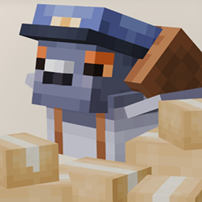

  
   

  

   

  <h2>Envelope [Unofficial Port]</h2>
  <h4><i>Letters, Packages, Deliveries and more...</i></h4>
  
A Minecraft mod that adds a classy mailing system.

   

  <h3>Original Mod</h3>

  

  

  

  <h3>Unofficial Port</h3>

  

   

  

  

<b>Modrinth is the recommended source for the Unofficial Port mod, as releases are published there first and more frequently.</b>

 

## About

**Envelope [Unofficial Port]** is an unofficial Fabric port of [Envelope](https://modrinth.com/mod/envelope) for **Minecraft 1.21.11**.

The original mod was not available for this Minecraft version, so I ported it to 1.21.11 to make it usable on newer Fabric installations.

This project is **not the original Envelope mod**. It is a community-made port intended to bring the original mod to a newer Minecraft version.

## How this port differs

The port is based on the original 0.7.5 release. Its core gameplay (pigeons, mailboxes, letters, packages, seals, and delivery) comes from upstream. This project adapts it for Fabric on Minecraft 1.21.11; it is not a new implementation of those features.

Changes added in this port:

* **Seal Stamp customization:** 16 dye colors plus gold; crafting preserves the selected die, and colored stamps can recolor existing seals. Undyed stamps cannot seal mail.
* **Original seal-impression artwork:** the stamp glyphs retain the upstream grayscale shading and detail when tinted; wax/background textures remain separate.
* **Seal material tinting:** `model_tint_color` colors the seal overlay on letters and packages, while `impression_palette` shades stamp and seal previews.
* **Courier ascent configuration:** `delivery.ascend_distance` controls how far couriers ascend; the default is 24 blocks.
* **Recipe updates:** removed the Slimeball from the Automated Supply Service Letter and Writable Book recipes, and revised the Seal Stamp recipe to use honeycomb, planks, and an iron ingot.

Some recipe changes were inspired by the partial 0.8.0-snapshot1 notes shared by the original creators; credit for those ideas belongs to them.

This is a partial adaptation of the upstream 0.8.0 notes. Features not implemented here, including Cloud Depository and Letter Presetting, are not included.

## Credits

Full credit goes to the original creators of **Envelope**.

The original creators retain credit for the original code, textures, models, images, assets, and overall mod concept. This port adapts that work for **Fabric 1.21.11** and includes the port-specific changes listed above.

Please support the original project and its creators:

* [Original Envelope on Modrinth](https://modrinth.com/mod/envelope)
* [Original Envelope on CurseForge](https://curseforge.com/minecraft/mc-mods/envelope)
* [Support the creators on Patreon](https://www.patreon.com/mortuusars?utm_medium=unknown&utm_source=join_link&utm_campaign=creatorshare_creator&utm_content=copyLink)
* [Donate via PayPal](https://www.paypal.com/donate/?hosted_button_id=YTSFJQ8XTXZBW)
* [Join their Discord](https://discord.com/invite/FzHKGDW2et)
* [Original Wiki](https://moddedmc.wiki/en/project/envelope/latest)

## Disclaimer

This is an **unofficial port** and is not affiliated with or endorsed by the original Envelope developers unless explicitly stated otherwise.

If you encounter an issue that is specific to the 1.21.11 port, please report it on this project's issue tracker. For issues with the original mod, please contact the original developers through the official project pages.

If you want to contact me directly, you can reach me on Discord at **matteo_sb**.

---

> As much as i am against AI in a lot of contexts, like daily life, school, art, and more, since i'm still a beginner i used it a little to ask questions, understand things, and check my code while learning. i still wrote and worked on the mod myself, and i mainly used AI as a learning tool. hope yall understand, especially since this is my first time porting a more complicated mod.
